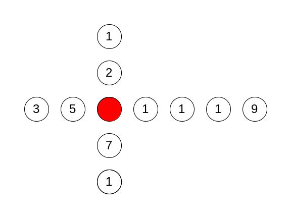

# Tokens

The task is to develop a program that solves logical game - "maximum token sum".

Two players A and B play the game. There are tokens placed on the table, the tokens form a cross-like shape. Each token holds an integer number - the value of the token. The value may be positive, zero, or negative. The only exception is a token in the center of the cross, this token does not hold any number. The players alternate, the game is started by player A. The player on move removes one of tokens located at the ends of the arms (i.e. there may be up to 4 options). The game ends when the last numbered token is removed (the central token is not removed). The player with the greater sum of tokens wins the game.

The input of the program defines the layout of the tokens - each arm of the cross is defined by a sequence of numbers (token values). The arms are identified by letters: N-North, E-East, W-West, and S-South. Each input sequence lists the tokens on the particular arm, starting from the outer end towards the center. The order of the North/South/East/West arms may be arbitrary. An example input is:

N: { 1, 2 }

W: { 3, 5 }

E: { 9, 1, 1, 1 }

S: { 1, 7 }

This input corresponds to the following layout:

The program reads the input and starts the simulation of the players. Player A starts first, the program chooses the best choice of the token. Then the program plays for player B and so on, until the last token is removed. The program always uses the best strategy for each turn, i.e., it always chooses the token that is the most beneficial to the players total score. Finally, the program prints out the turns and the total score:

A: E[0] (9)

B: E[1] (1)

A: N[0] (1)

B: N[1] (2)

A: S[0] (1)

B: S[1] (7)

A: W[0] (3)

B: W[1] (5)

A: E[2] (1)

B: E[3] (1)

Total A/B: 15/16

Here, the first line is the first turn of player A. The player takes token from the East arm located on index 0, the token is labeled with value 9. Next, player B takes token located on position 1 in the East arm, the token is labeled with value 1, ... The total score is 15 for player A and 16 for player B.

The program must validate input data. If the input is invalid, the program must detect it, it shall output an error message (see below) and terminate. If displayed, the error message must be displayed to the standard output (do not send it to the error output) and the error message must be terminated by a newline (\n). The input is considered invalid, if:

- Some arm of the cross is missing, some arm was entered multiple times, or the identifier of the arm is invalid (valid is N, E, W or S),
- an arm is empty (no token listed),
- an arm contains more than 32 tokens,
- some separator is missing or misplaced (comma, colon, curly braces),
- token value is not a valid integer.

---

<b>Sample program runs:</b>

---

<b>Tokens:</b>
N: { 1, 2 }

W: { 5 }

E: { 1, 1, 1 }

S: { 1, 7 }

<b>A: S[0] (1)

B: S[1] (7)

A: W[0] (5)

B: E[0] (1)

A: N[0] (1)

B: N[1] (2)

A: E[1] (1)

B: E[2] (1)

Total A/B: 8/11</b>

---

<b>Tokens:</b>
N: { 1, 2 }

W: { 3, 5 }

E: { 9, 1, 1, 1 }

S: { 1, 7 }

<b>A: E[0] (9)

B: E[1] (1)

A: N[0] (1)

B: N[1] (2)

A: S[0] (1)

B: S[1] (7)

A: W[0] (3)

B: W[1] (5)

A: E[2] (1)

B: E[3] (1)

Total A/B: 15/16</b>
